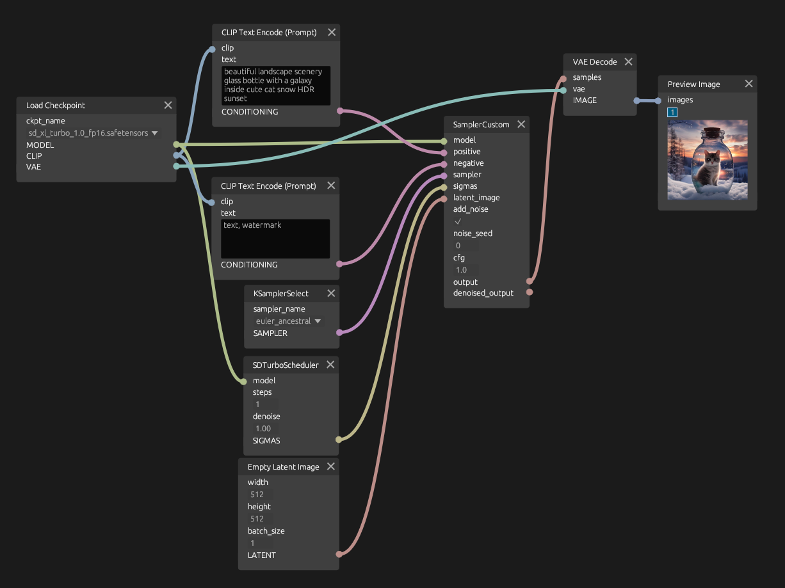

# `rucomfyui`

A Rust client for ComfyUI with an emphasis on type safety and ergonomics.

## `rucomfyui`

The client library. See [the README](./crates/rucomfyui/README.md).

## `rucomfyui_node_graph`

A recreation of the ComfyUI node graph in Rust using `egui`, `egui_node_graph2` and `rucomfyui`.
See [the README](./crates/rucomfyui_node_graph/README.md).

## `rucomfyui_node_graph_demo`

A demo application for the `rucomfyui_node_graph` crate.
See [the README](./bin/rucomfyui_node_graph_demo/README.md).