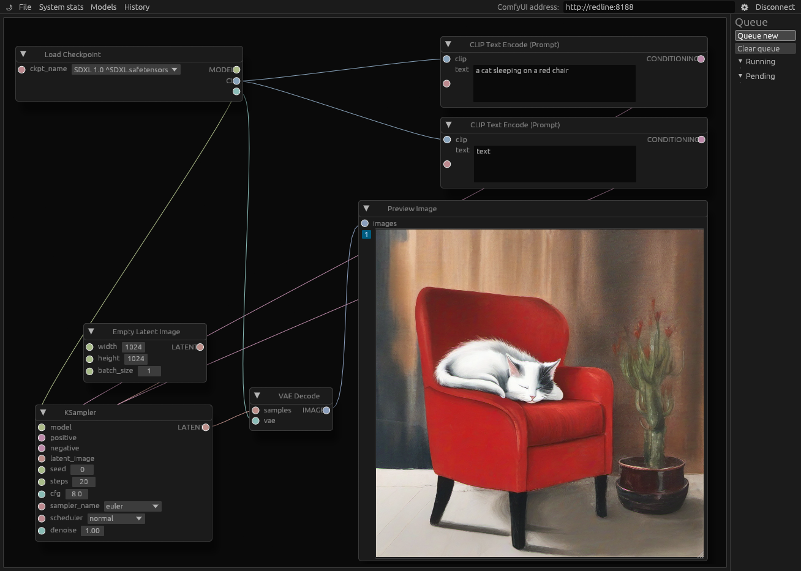

# `rucomfyui`

A Rust client for ComfyUI with an emphasis on type safety and ergonomics, plus a
set of crates built on top of it for converting, building and visualising workflows.

## Libraries

- [`rucomfyui`](./crates/rucomfyui) — the client library. Typed node definitions,
  workflow construction, queueing, and (optionally) live progress over WebSocket.
- [`rucomfyui_node_graph`](./crates/rucomfyui_node_graph) — a recreation of the
  ComfyUI node graph in Rust using `egui` and `egui-snarl`.
- [`rucomfyui_workflow_converter`](./crates/rucomfyui_workflow_converter) — converts
  ComfyUI API workflows (JSON) to typed Rust or Lua code.
- [`rucomfyui_mlua`](./crates/rucomfyui_mlua) — Lua bindings for `rucomfyui`,
  enabling workflow construction from Lua scripts.

## Binaries

- [`rucomfyui_node_graph_demo`](./bin/rucomfyui_node_graph_demo) — a demo app for the
  node graph editor: connect to ComfyUI, load/save workflows, queue, and view results.
- [`rucomfyui_workflow_converter_cli`](./bin/rucomfyui_workflow_converter) — a CLI
  wrapping `rucomfyui_workflow_converter`.
- [`rucomfyui_lua_script_runner`](./bin/rucomfyui_lua_script_runner) — runs Lua
  workflow scripts against a ComfyUI server using `rucomfyui_mlua`.

## License

Licensed under either of [Apache License, Version 2.0](LICENSE-APACHE) or
[MIT license](LICENSE-MIT) at your option.
